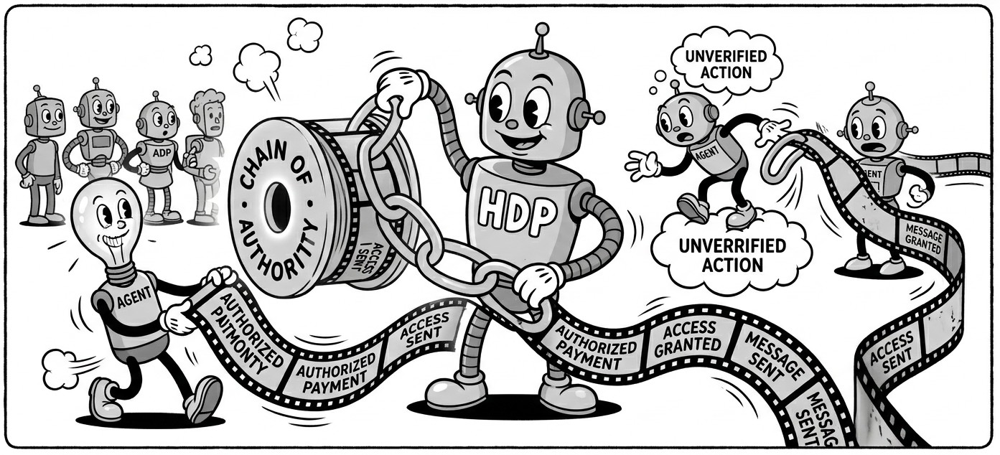
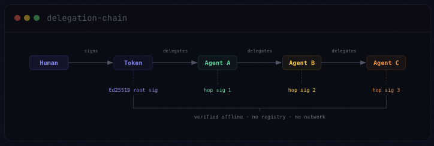

<div align="center">

# HDP — Human Delegation Provenance Protocol

**A cryptographic chain-of-custody protocol for agentic AI systems.**
_Every action an AI agent takes, traceable back to the human who authorized it._



<br/>

[](https://www.npmjs.com/package/@helixar_ai/hdp)
[](https://pypi.org/project/hdp-crewai/)
[](https://pypi.org/project/hdp-grok/)
[](https://creativecommons.org/licenses/by/4.0/)
[](https://www.typescriptlang.org/)
[](https://www.python.org/)
[](https://nodejs.org/)
[](https://github.com/Helixar-AI/HDP/actions)
[](https://github.com/Helixar-AI/HDP/blob/main/tests/security/offline-verification.test.ts)
[](https://datatracker.ietf.org/doc/html/rfc8032)
[](./packages/hdp-mcp)
[](./packages/hdp-crewai)
[](./packages/hdp-grok)
[](./packages/hdp-autogen)
[](https://github.com/Helixar-AI/ReleaseGuard)
[](https://doi.org/10.5281/zenodo.19332023)
[](https://arxiv.org/abs/2604.04522)

<br/>



</div>

---

## What is HDP?

HDP (Human Delegation Provenance) is an open protocol that captures, structures, cryptographically signs, and verifies the human authorization context in agentic AI systems.

When a person authorizes an AI agent to act — and that agent delegates to another agent, and another — HDP creates a tamper-evident chain of custody from the authorizing human to every downstream action. The full delegation trail is encoded in a compact, self-contained token signed with Ed25519 and canonicalized with RFC 8785. Verification is fully offline: it requires only a public key, no central registry, no network call.

**Who it is for:** developers building AI agents with Grok/xAI, CrewAI, MCP servers, or any OpenAI-compatible API who need accountability, auditability, and proof of human authorization at every step.

---

## Packages

| Package                                                | Registry                                                     | Language   | Framework             | Description                                                                |
| ------------------------------------------------------ | ------------------------------------------------------------ | ---------- | --------------------- | -------------------------------------------------------------------------- |
| [`@helixar_ai/hdp`](./src)                             | [npm](https://www.npmjs.com/package/@helixar_ai/hdp)         | TypeScript | Any                   | Core SDK — issue, extend, verify HDP tokens                                |
| [`@helixar_ai/hdp-mcp`](./packages/hdp-mcp)            | [npm](https://www.npmjs.com/package/@helixar_ai/hdp-mcp)     | TypeScript | MCP                   | MCP middleware — attaches HDP to any MCP server                            |
| [`@helixar_ai/hdp-physical`](./packages/hdp-physical)  | [npm](https://www.npmjs.com/package/@helixar_ai/hdp-physical) | TypeScript | Physical AI / Robotics | HDP-P guardrails — signs EDTs and blocks unsafe robot actions pre-execution |
| [`hdp-physical`](./packages/hdp-physical-py)           | [PyPI](https://pypi.org/project/hdp-physical/)               | Python     | Physical AI / Robotics | HDP-P guardrails — Python SDK for EDT issuance and pre-execution checks     |
| [`hdp-crewai`](./packages/hdp-crewai)                  | [PyPI](https://pypi.org/project/hdp-crewai/)                 | Python     | CrewAI                | CrewAI middleware — attaches HDP to any crew                               |
| [`hdp-grok`](./packages/hdp-grok)                      | [PyPI](https://pypi.org/project/hdp-grok/)                   | Python     | Grok / xAI            | Grok middleware — attaches HDP to any xAI conversation                     |
| [`hdp-autogen`](./packages/hdp-autogen)                | [PyPI](https://pypi.org/project/hdp-autogen/)                | Python     | AutoGen               | AutoGen middleware — attaches HDP to any AutoGen agent or GroupChat        |
| [`@helixar_ai/hdp-autogen`](./packages/hdp-autogen-ts) | [npm](https://www.npmjs.com/package/@helixar_ai/hdp-autogen) | TypeScript | AutoGen               | AutoGen middleware — HdpAgentWrapper + hdpMiddleware for AutoGen flows     |
| [`hdp-langchain`](./packages/hdp-langchain)            | [PyPI](https://pypi.org/project/hdp-langchain/)              | Python     | LangChain / LangGraph | LangChain middleware — attaches HDP to any chain, agent, or LangGraph node |

## Install

**TypeScript / Node.js**

```bash
npm install @helixar_ai/hdp
```

**TypeScript / Physical AI**

```bash
npm install @helixar_ai/hdp-physical
```

**Python / CrewAI**

```bash
pip install hdp-crewai
```

**Python / Physical AI**

```bash
pip install hdp-physical
```

**Python / Grok (xAI API)**

```bash
pip install hdp-grok
```

**Python / AutoGen**

```bash
pip install hdp-autogen
```

**Python / LangChain**

```bash
pip install hdp-langchain
```

---

## Quickstart — TypeScript

Issue a root token, extend it through a delegation chain, verify it offline. Under 2 minutes.

```typescript
import {
  generateKeyPair,
  issueToken,
  extendChain,
  verifyToken,
} from "@helixar_ai/hdp";

// 1. Generate a key pair for the issuer
const { privateKey, publicKey } = await generateKeyPair();

// 2. Issue a token (the human authorization event)
let token = await issueToken({
  sessionId: "sess-20260326-abc123",
  principal: {
    id: "usr_alice_opaque",
    id_type: "opaque",
    display_name: "Alice Chen",
  },
  scope: {
    intent: "Analyze Q1 sales data and generate a summary report.",
    authorized_tools: ["database_read", "file_write"],
    authorized_resources: ["db://sales/q1-2026"],
    data_classification: "confidential",
    network_egress: false,
    persistence: true,
    max_hops: 3,
  },
  signingKey: privateKey,
  keyId: "alice-signing-key-v1",
});

// 3. Extend the chain as the task delegates to agents
token = await extendChain(
  token,
  {
    agent_id: "orchestrator-v2",
    agent_type: "orchestrator",
    action_summary: "Decompose analysis task and delegate to sub-agents.",
    parent_hop: 0,
  },
  privateKey,
);

token = await extendChain(
  token,
  {
    agent_id: "sql-agent-v1",
    agent_type: "sub-agent",
    action_summary: "Execute read query against sales database.",
    parent_hop: 1,
  },
  privateKey,
);

// 4. Verify at any point in the chain — fully offline, no network call
const result = await verifyToken(token, {
  publicKey,
  currentSessionId: "sess-20260326-abc123",
});

console.log(result.valid); // true
console.log(token.chain.length); // 2
```

---

## Physical AI Integration

`@helixar_ai/hdp-physical` and `hdp-physical` extend HDP into robotics with Embodied Delegation Tokens (EDTs) and a pre-execution guard. Before a motion command reaches an actuator, HDP-P verifies the EDT signature, checks the irreversibility ceiling, enforces excluded zones, and blocks actions that exceed force or velocity limits.

```typescript
import {
  EdtBuilder,
  IrreversibilityClass,
  PreExecutionGuard,
  signEdt,
} from "@helixar_ai/hdp-physical";
import { generateKeyPair } from "@helixar_ai/hdp";

const { privateKey, publicKey } = await generateKeyPair();

const edt = new EdtBuilder()
  .setEmbodiment({
    agent_type: "robot_arm",
    platform_id: "aloha_v2",
    workspace_scope: "zone_A",
  })
  .setActionScope({
    permitted_actions: ["pick", "place", "move"],
    excluded_zones: ["human_zone"],
    max_force_n: 45,
    max_velocity_ms: 0.5,
  })
  .setIrreversibility({
    max_class: IrreversibilityClass.REVERSIBLE_WITH_EFFORT,
    class2_requires_confirmation: true,
    class3_prohibited: true,
  })
  .setPolicyAttestation({
    policy_hash: "sha256-of-weights",
    training_run_id: "run-1",
    sim_validated: true,
  })
  .setDelegationScope({
    allow_fleet_delegation: false,
    max_delegation_depth: 1,
    sub_agent_whitelist: [],
  })
  .build();

const signedEdt = await signEdt(edt, privateKey, "robot-key-v1");
const guard = new PreExecutionGuard();

const decision = await guard.authorize(
  {
    description: "pick box from left bin",
    force_n: 5,
    velocity_ms: 0.2,
  },
  signedEdt,
  publicKey,
);

console.log(decision.approved);
```

For Python, install `hdp-physical` and use the same EDT model and guard flow, with optional `lerobot` and `gemma` extras for adapters and interception.

→ [Full TypeScript physical AI docs](./packages/hdp-physical/README.md)
→ [Full Python physical AI docs](./packages/hdp-physical-py/README.md)

---

## Grok / xAI Integration

`hdp-grok` attaches HDP to any Grok conversation via three native tool schemas. No changes to your prompts or model configuration are required — Grok calls `hdp_issue_token`, `hdp_extend_chain`, and `hdp_verify_token` as regular tool calls, and `HdpMiddleware` handles everything statelessly behind the scenes.

```python
import json
import os
from openai import OpenAI
from hdp_grok import HdpMiddleware, get_hdp_tools

# xAI API — OpenAI-compatible endpoint
client = OpenAI(
    api_key=os.environ["XAI_API_KEY"],
    base_url="https://api.x.ai/v1",
)

# One middleware instance per conversation
middleware = HdpMiddleware(
    signing_key=os.getenv("HDP_SIGNING_KEY"),  # base64url Ed25519 private key
    principal_id="user@example.com",
)

messages = [{"role": "user", "content": "Issue an HDP token and delegate to research-agent."}]

while True:
    response = client.chat.completions.create(
        model="grok-3",
        messages=messages,
        tools=get_hdp_tools(),  # inject the three HDP tool schemas
    )
    choice = response.choices[0]

    if choice.finish_reason == "tool_calls":
        messages.append(choice.message)
        for tc in choice.message.tool_calls:
            result = middleware.handle_tool_call(
                name=tc.function.name,
                args=json.loads(tc.function.arguments),
            )
            messages.append({
                "role": "tool",
                "tool_call_id": tc.id,
                "content": json.dumps(result),
            })
    else:
        print(choice.message.content)
        break

# Full delegation chain — verifiable offline with the public key
print(middleware)  # HdpMiddleware(session_id='...', hops=2, valid=True)
```

### Three HDP tools Grok can call

| Tool               | Required args  | What it does                                              |
| ------------------ | -------------- | --------------------------------------------------------- |
| `hdp_issue_token`  | —              | Signs a root token for the session and principal          |
| `hdp_extend_chain` | `delegatee_id` | Appends a signed delegation hop (e.g. to a sub-agent)     |
| `hdp_verify_token` | `token`        | Verifies the full chain using the middleware's public key |

### What `HdpMiddleware` manages for you

- Holds the Ed25519 signing key (bytes, hex, base64url, or `HDP_SIGNING_KEY` env var)
- Maintains the current token and hop counter for the conversation lifetime
- Routes all `hdp_*` tool calls via `handle_tool_call(name, args)`
- Handles both snake_case and camelCase argument names from Grok
- Raises typed errors: `HdpTokenMissingError`, `HdpTokenExpiredError`, `HdpSigningKeyError`

→ [Full Grok integration docs](./packages/hdp-grok/README.md)

---

## CrewAI Integration

`hdp-crewai` attaches HDP to any CrewAI crew with a single `middleware.configure(crew)` call. No changes to your agents, tasks, or crew configuration are required.

```python
from cryptography.hazmat.primitives.asymmetric.ed25519 import Ed25519PrivateKey
from crewai import Agent, Crew, Task
from hdp_crewai import HdpMiddleware, HdpPrincipal, ScopePolicy, verify_chain

private_key = Ed25519PrivateKey.generate()

middleware = HdpMiddleware(
    signing_key=private_key.private_bytes_raw(),
    session_id="q1-review-2026",
    principal=HdpPrincipal(id="analyst@company.com", id_type="email"),
    scope=ScopePolicy(
        intent="Analyse Q1 sales data and produce a summary",
        authorized_tools=["FileReadTool", "CSVAnalysisTool"],
        max_hops=5,
    ),
)

crew = Crew(agents=[...], tasks=[...])
middleware.configure(crew)  # attach HDP — one line, zero crew changes
crew.kickoff()

# Verify the full delegation chain offline
result = verify_chain(middleware.export_token(), private_key.public_key())
print(result.valid, result.hop_count, result.violations)
```

| #   | Consideration          | Behaviour                                                                                                                                                      |
| --- | ---------------------- | -------------------------------------------------------------------------------------------------------------------------------------------------------------- |
| 1   | **Scope enforcement**  | `step_callback` checks every tool call against `authorized_tools`. `strict=True` raises `HDPScopeViolationError`; default logs and records in the audit trail. |
| 2   | **Delegation depth**   | `max_hops` is enforced per run; hops beyond the limit are skipped and warned.                                                                                  |
| 3   | **Token size / perf**  | Ed25519 = 64 bytes/hop. All operations are non-blocking — failures log, never halt the crew.                                                                   |
| 4   | **Verification**       | `verify_chain(token, public_key)` validates root + every hop offline.                                                                                          |
| 5   | **Memory integration** | Signed token is persisted to CrewAI's storage directory for retroactive auditing.                                                                              |

→ [Full CrewAI integration docs](./packages/hdp-crewai/README.md)

---

## AutoGen Integration

`hdp-autogen` attaches HDP to any AutoGen `ConversableAgent` or `GroupChatManager` with a single `middleware.configure(target)` call. Each speaker turn in a GroupChat is recorded as a delegation hop.

```python
from cryptography.hazmat.primitives.asymmetric.ed25519 import Ed25519PrivateKey
from autogen import ConversableAgent, GroupChat, GroupChatManager
from hdp_autogen import HdpMiddleware, HdpPrincipal, ScopePolicy, verify_chain

private_key = Ed25519PrivateKey.generate()

middleware = HdpMiddleware(
    signing_key=private_key.private_bytes_raw(),
    session_id="research-2026-q1",
    principal=HdpPrincipal(id="researcher@lab.edu", id_type="email"),
    scope=ScopePolicy(
        intent="Coordinate research agents to summarise recent papers",
        authorized_tools=["web_search", "file_reader"],
        max_hops=10,
    ),
)

researcher = ConversableAgent("researcher", ...)
reviewer = ConversableAgent("reviewer", ...)
groupchat = GroupChat(agents=[researcher, reviewer], messages=[])
manager = GroupChatManager(groupchat=groupchat, ...)

middleware.configure(manager)  # hooks all agents + wraps run_chat
manager.run_chat(messages=[{"role": "user", "content": "Summarise recent LLM papers"}])

# Verify the full delegation chain offline
result = verify_chain(middleware.export_token(), private_key.public_key())
print(result.valid, result.hop_count, result.violations)
```

| #   | Consideration             | Behaviour                                                                                                                                                              |
| --- | ------------------------- | ---------------------------------------------------------------------------------------------------------------------------------------------------------------------- |
| 1   | **Scope enforcement**     | Incoming messages are inspected for tool calls against `authorized_tools`. `strict=True` raises `HDPScopeViolationError`; default logs and records in the audit trail. |
| 2   | **Delegation depth**      | `max_hops` is enforced per conversation; hops beyond the limit are skipped and warned.                                                                                 |
| 3   | **Token size / perf**     | Ed25519 = 64 bytes/hop. All operations are non-blocking — failures log, never halt agents.                                                                             |
| 4   | **Verification**          | `verify_chain(token, public_key)` validates root + every hop offline.                                                                                                  |
| 5   | **GroupChat integration** | `configure()` detects `ConversableAgent` vs `GroupChatManager` and attaches the appropriate hooks automatically.                                                       |

→ [Full AutoGen integration docs](./packages/hdp-autogen/README.md)

---

## Key Management

HDP ships a `KeyRegistry` for `kid → publicKey` resolution and a well-known endpoint format for automated key distribution.

```typescript
import { KeyRegistry, generateKeyPair, exportPublicKey } from "@helixar_ai/hdp";

const registry = new KeyRegistry();

const { privateKey, publicKey } = await generateKeyPair();
registry.register("signing-key-v1", publicKey);

// Resolve a key before verification
const key = registry.resolve(token.signature.kid); // Uint8Array | null

// Rotate: revoke old, register new
registry.revoke("signing-key-v1");
registry.register("signing-key-v2", newPublicKey);

// Export for /.well-known/hdp-keys.json
const doc = registry.exportWellKnown();
// → { keys: [{ kid, alg: 'Ed25519', pub: '<base64url>' }] }
```

| Environment       | Recommended storage                                        |
| ----------------- | ---------------------------------------------------------- |
| Development       | In-memory `KeyRegistry`, keys generated per-process        |
| Staging           | Environment variables via secrets manager                  |
| Production        | HSM or cloud KMS (AWS KMS, GCP Cloud HSM, Azure Key Vault) |
| Edge / serverless | Pre-distributed public keys; private key in secure enclave |

**Key rotation:** Issue new tokens with a new `kid` while keeping the old key in the verifier registry until all tokens signed with it have expired.

---

## Offline Verification

HDP verification requires **zero network calls**. The complete trust state is:

- The issuer's Ed25519 public key (32 bytes)
- The current `session_id` (string)
- The current time (for expiry check)

```typescript
import { verifyToken } from "@helixar_ai/hdp";

// Works in air-gapped environments, edge runtimes, or any context
// where a network call before every agent action is unacceptable.
const result = await verifyToken(token, {
  publicKey, // locally held — no fetch
  currentSessionId: "sess-20260326-abc", // locally known — no registry
});
```

This is architecturally enforced: the 7-step verification pipeline has no I/O operations. It is proven by the test suite (`tests/security/offline-verification.test.ts`) which intercepts all network calls and asserts none are made during verification.

---

## Streaming Sessions & Re-Authorization

Long-running tasks may exhaust `max_hops`, expand their scope, or require fresh human confirmation mid-session. Issue a re-authorization token rather than modifying the original.

```typescript
import { issueReAuthToken } from "@helixar_ai/hdp";

const reAuth = await issueReAuthToken({
  original: exhaustedToken,
  scope: {
    ...exhaustedToken.scope,
    intent: "Continue analysis: generate charts from extracted data.",
    max_hops: 3,
  },
  signingKey: privateKey,
  keyId: "signing-key-v1",
});
// reAuth.header.parent_token_id === exhaustedToken.header.token_id
```

| Session type               | Recommended `expiresInMs` |
| -------------------------- | ------------------------- |
| Short interactive task     | 15–60 minutes             |
| Background batch job       | 4–8 hours                 |
| Default                    | 24 hours                  |
| High-risk / elevated scope | 5–15 minutes              |

---

## Multi-Principal Delegation

For actions requiring joint authorization by multiple humans, chain tokens sequentially — each human issues a token pointing to the previous one.

```typescript
import { issueToken, issueReAuthToken, verifyPrincipalChain } from '@helixar_ai/hdp'

const t1 = await issueToken({ /* Alice authorizes */ signingKey: alicePrivateKey, keyId: 'alice-key', ... })
const t2 = await issueReAuthToken({ original: t1, /* Bob co-authorizes */ signingKey: bobPrivateKey, keyId: 'bob-key', ... })

const result = await verifyPrincipalChain(
  [{ token: t1, publicKey: alicePublicKey }, { token: t2, publicKey: bobPublicKey }],
  { currentSessionId: 'sess-joint-approval' }
)
// result.valid === true, t2.header.parent_token_id === t1.header.token_id
```

**HDP v0.2 preview — `CoAuthorizationRequest`:** Simultaneous multi-signature using a threshold scheme (FROST / Schnorr multisig) is planned for v0.2.

---

## Privacy Utilities

```typescript
import { stripPrincipal, redactPii, buildAuditSafe } from "@helixar_ai/hdp";

const safeForTransmission = stripPrincipal(token); // remove all principal PII
const anonymized = redactPii(token); // principal.id → '[REDACTED]'
const auditEntry = buildAuditSafe(token); // token_id + intent + chain summary
```

---

## Verification Pipeline

`verifyToken()` runs a 7-step pipeline defined in HDP spec §7.3:

1. Version check
2. Expiry (`expires_at`)
3. Root signature (Ed25519 over header + principal + scope)
4. Hop signatures — mandatory per §6.3 Rule 6 (each hop signs cumulative chain state)
5. `max_hops` constraint
6. Session ID binding (replay defense)
7. Proof-of-Humanity credential (optional, application-supplied callback)

---

## Why Not IPP?

The [Intent Provenance Protocol](https://datatracker.ietf.org/doc/html/draft-haberkamp-ipp-00) (draft-haberkamp-ipp-00) solves the same problem with different trade-offs. The critical difference: **IPP requires agents to poll a central revocation registry every 5 seconds**. If the registry is unreachable, agents cannot safely act. Every IPP token is also cryptographically anchored to `ipp.khsovereign.com/keys/founding_public.pem` — making fully self-sovereign deployment impossible.

HDP verification is fully offline. It requires only a public key and a session ID. No registry. No central endpoint. No third-party trust anchor.

→ [Full technical comparison: COMPARISON.md](./COMPARISON.md)

---

## Scope Boundary

**HDP stops at provenance. It does not enforce.**

HDP records that a human authorized an agent to act, with what scope, through what chain. It does not:

- Prevent an agent from exceeding its declared scope at runtime
- Enforce `authorized_tools` or `data_classification` constraints at the model layer
- Make revocation decisions
- Provide a central authority

Applications that need runtime enforcement should treat HDP tokens as audit input and implement enforcement at the application layer.

---

## Security

HDP v0.1 has been audited against spec §12's 10 threat scenarios. See [docs/security/audit-report-v0.1.md](./docs/security/audit-report-v0.1.md).

Test coverage includes: token forgery, chain tampering, prompt injection, seq gap / chain poisoning, replay attack (session + expiry), and offline verification guarantee.

---

## Releasing

This monorepo uses **five independent tag prefixes** to release packages separately.

### TypeScript core packages → npm

Publishes `@helixar_ai/hdp`, `@helixar_ai/hdp-mcp`, and `hdp-validate` CLI:

```bash
git tag v0.1.2 && git push origin v0.1.2
```

Pipeline: `test-node` → `vet-node` (ReleaseGuard) → `publish-hdp` + `publish-hdp-mcp` + `publish-hdp-cli` + `publish-hdp-autogen-ts`

### @helixar_ai/hdp-autogen → npm

Publishes only `@helixar_ai/hdp-autogen` (TypeScript AutoGen middleware):

```bash
git tag node/hdp-autogen/v0.1.2 && git push origin node/hdp-autogen/v0.1.2
```

Pipeline: `test-hdp-autogen-ts` → `vet-hdp-autogen-ts` (ReleaseGuard) → `publish-hdp-autogen-ts-standalone`

### hdp-crewai → PyPI

```bash
git tag python/v0.1.1 && git push origin python/v0.1.1
```

Pipeline: `test-python` → `vet-hdp-crewai` (ReleaseGuard) → `publish-hdp-crewai`

### hdp-grok → PyPI

```bash
git tag python/hdp-grok/v0.1.1 && git push origin python/hdp-grok/v0.1.1
```

Pipeline: `test-hdp-grok` → `vet-hdp-grok` (ReleaseGuard) → `publish-hdp-grok`

### hdp-autogen → PyPI

```bash
git tag python/hdp-autogen/v0.1.2 && git push origin python/hdp-autogen/v0.1.2
```

Pipeline: `test-hdp-autogen` → `vet-hdp-autogen` (ReleaseGuard) → `publish-hdp-autogen`

### Artifact vetting — ReleaseGuard

Every artifact is scanned by [ReleaseGuard](https://github.com/Helixar-AI/ReleaseGuard) before it reaches PyPI or npm — checking for secrets, unexpected files, license compliance, and generating a CycloneDX SBOM. The exact vetted artifact is what gets published. If ReleaseGuard fails, the publish job never runs.

```bash
# Vet locally before tagging
cd packages/hdp-grok && python -m build && releaseguard check ./dist
cd packages/hdp-crewai && python -m build && releaseguard check ./dist
cd packages/hdp-autogen && python -m build && releaseguard check ./dist
cd packages/hdp-autogen-ts && npm run build && releaseguard check ./dist
```

---

## Spec

Full protocol specification: [https://helixar.ai/about/labs/hdp/](https://helixar.ai/about/labs/hdp/)

## Citation

If you use HDP in your research, please cite:

```bibtex
@misc{dalugoda2026hdp,
  title        = {{HDP}: A Lightweight Cryptographic Protocol for Human Delegation
                  Provenance in Agentic {AI} Systems},
  author       = {Dalugoda, Asiri},
  year         = {2026},
  month        = apr,
  eprint       = {2604.04522},
  archivePrefix = {arXiv},
  primaryClass = {cs.CR},
  url          = {https://arxiv.org/abs/2604.04522},
}
```

---

## License

[CC BY 4.0](./LICENSE) — Helixar Limited
