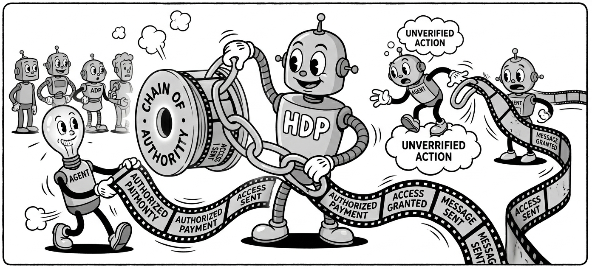
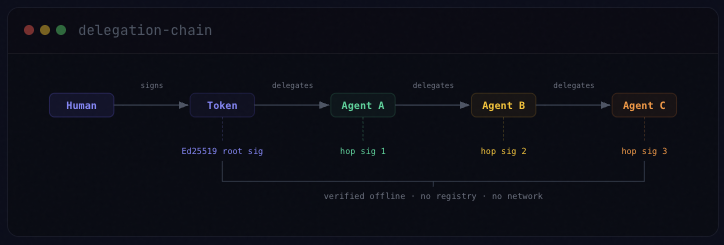

<div align="center">

# HDP — Human Delegation Provenance Protocol

**A cryptographic chain-of-custody protocol for agentic AI systems.**
_Signed delegation context and agent activity, preserved for audit._



<br/>

[](https://www.npmjs.com/package/@helixar_ai/hdp)
[](https://pypi.org/project/hdp-crewai/)
[](https://pypi.org/project/hdp-grok/)
[](https://pypi.org/project/hdp-agent-framework/)
[](https://www.apache.org/licenses/LICENSE-2.0)
[](https://www.typescriptlang.org/)
[](https://www.python.org/)
[](https://nodejs.org/)
[](https://github.com/Helixar-AI/HDP/actions)
[](https://github.com/Helixar-AI/HDP/blob/main/tests/security/offline-verification.test.ts)
[](https://datatracker.ietf.org/doc/html/rfc8032)
[](./packages/hdp-mcp)
[](./packages/hdp-crewai)
[](./packages/hdp-grok)
[](./packages/hdp-autogen)
[](./packages/hdp-agent-framework)
[](./packages/hdp-langchain)
[](./packages/llama-index-callbacks-hdp)
[](https://pypi.org/project/llama-index-callbacks-hdp/)
[](https://github.com/Helixar-AI/ReleaseGuard)
[](https://doi.org/10.5281/zenodo.19332023)
[](https://arxiv.org/abs/2604.04522)
[](https://datatracker.ietf.org/doc/draft-helixar-hdp-agentic-delegation/)

<br/>



</div>

---

## What is HDP?

HDP (Human Delegation Provenance) is an open protocol that captures, structures, cryptographically signs, and verifies records of human delegation context in agentic AI systems.

When a person delegates a task to an AI agent, and that agent delegates to another agent, HDP creates a tamper-evident chain from the issuer's signed statement to the activity each hop records. The full trail is encoded in a compact, self-contained token signed with Ed25519 and canonicalized with RFC 8785. Integrity verification is fully offline and uses the issuer's public key; it does not depend on the current time, a session, or verifier state.

**Who it is for:** developers building AI agents with Grok/xAI, CrewAI, MCP servers, or any OpenAI-compatible API who need accountable, auditable records of delegation context and subsequent agent activity.

**Boundary:** HDP is not an authorization protocol, capability, access token, or credential. A valid token proves that its signed record is authentic and intact; it does not grant access, prove that an action occurred, or show that a named delegate consented. Services must make authorization decisions using their own access-control system.

**Standardization:** HDP is specified in the IETF individual Internet-Draft [draft-helixar-hdp-agentic-delegation](https://datatracker.ietf.org/doc/draft-helixar-hdp-agentic-delegation/) (Informational). Draft -03 defines HDP as record-only: verification establishes record integrity, while each service makes action decisions through its own access control system. The v0.1 token structure and signature payloads are unchanged.

→ [Protocol boundaries and audit semantics](./docs/audit-semantics.md)

> **Draft -03 record-only semantics:** Use the standard HTTP field names `HDP-Token` and `HDP-Token-Ref`. Maintained middleware accepts the former `X-HDP-*` names as deprecated input aliases during migration. Missing or invalid HDP input is an audit finding and does not decide whether a handler runs. Earlier SDK releases signed different, non-interoperable root and hop payload shapes; tokens they emitted must be reissued because corrected implementations do not silently fall back to the earlier signature scheme.

---

## Packages

| Package                                                | Registry                                                     | Language   | Framework             | Description                                                                |
| ------------------------------------------------------ | ------------------------------------------------------------ | ---------- | --------------------- | -------------------------------------------------------------------------- |
| [`@helixar_ai/hdp`](./src)                             | [npm](https://www.npmjs.com/package/@helixar_ai/hdp)         | TypeScript | Any                   | Core SDK — issue, extend, verify HDP tokens                                |
| [`@helixar_ai/hdp-mcp`](./packages/hdp-mcp)            | [npm](https://www.npmjs.com/package/@helixar_ai/hdp-mcp)     | TypeScript | MCP                   | MCP middleware — attaches HDP to any MCP server                            |
| [`@helixar_ai/hdp-physical`](./packages/hdp-physical)  | [npm](https://www.npmjs.com/package/@helixar_ai/hdp-physical) | TypeScript | Physical AI / Robotics | HDP-P guardrails — signs EDTs and blocks unsafe robot actions pre-execution |
| [`hdp-physical`](./packages/hdp-physical-py)           | [PyPI](https://pypi.org/project/hdp-physical/)               | Python     | Physical AI / Robotics | HDP-P guardrails — Python SDK for EDT issuance and pre-execution checks     |
| [`hdp-crewai`](./packages/hdp-crewai)                  | [PyPI](https://pypi.org/project/hdp-crewai/)                 | Python     | CrewAI                | CrewAI middleware — attaches HDP to any crew                               |
| [`hdp-grok`](./packages/hdp-grok)                      | [PyPI](https://pypi.org/project/hdp-grok/)                   | Python     | Grok / xAI            | Grok middleware — attaches HDP to any xAI conversation                     |
| [`hdp-autogen`](./packages/hdp-autogen)                | [PyPI](https://pypi.org/project/hdp-autogen/)                | Python     | AutoGen               | AutoGen middleware — attaches HDP to any AutoGen agent or GroupChat        |
| [`hdp-agent-framework`](./packages/hdp-agent-framework) | [PyPI](https://pypi.org/project/hdp-agent-framework/)       | Python     | Microsoft agent-framework | agent-framework middleware — attaches HDP to any Agent or workflow    |
| [`@helixar_ai/hdp-autogen`](./packages/hdp-autogen-ts) | [npm](https://www.npmjs.com/package/@helixar_ai/hdp-autogen) | TypeScript | AutoGen               | AutoGen middleware — HdpAgentWrapper + hdpMiddleware for AutoGen flows     |
| [`hdp-langchain`](./packages/hdp-langchain)            | [PyPI](https://pypi.org/project/hdp-langchain/)              | Python     | LangChain / LangGraph | LangChain middleware — attaches HDP to any chain, agent, or LangGraph node |
| [`llama-index-callbacks-hdp`](./packages/llama-index-callbacks-hdp) | [PyPI](https://pypi.org/project/llama-index-callbacks-hdp/) | Python | LlamaIndex | LlamaIndex integration — callback handler, instrumentation dispatcher, node postprocessor |
| [`hdp-llamaindex`](./packages/hdp-llamaindex)          | [PyPI](https://pypi.org/project/hdp-llamaindex/)             | Python     | LlamaIndex            | Metapackage — `pip install hdp-llamaindex` for HDP-first users             |

## Install

**TypeScript / Node.js**

```bash
npm install @helixar_ai/hdp
```

**TypeScript / Physical AI**

```bash
npm install @helixar_ai/hdp-physical
```

**Python / CrewAI**

```bash
pip install hdp-crewai
```

**Python / Physical AI**

```bash
pip install hdp-physical
```

**Python / Grok (xAI API)**

```bash
pip install hdp-grok openai
```

**Python / AutoGen**

```bash
pip install hdp-autogen
```

**Python / Microsoft agent-framework**

```bash
pip install hdp-agent-framework agent-framework-foundry azure-identity
# Set FOUNDRY_PROJECT_ENDPOINT and FOUNDRY_MODEL for the deployment.
```

**Python / LangChain**

```bash
pip install hdp-langchain
```

**Python / LlamaIndex**

```bash
pip install llama-index-callbacks-hdp
# or, from the HDP side:
pip install hdp-llamaindex
```

---

## Quickstart — TypeScript

Issue a root token, extend it through a delegation chain, verify it offline. Under 2 minutes.

```typescript
import {
  generateKeyPair,
  issueToken,
  extendChain,
  verifyToken,
} from "@helixar_ai/hdp";

// 1. Generate a key pair for the issuer
const { privateKey, publicKey } = await generateKeyPair();

// 2. Issue a token (the issuer's signed record of the delegation context)
let token = await issueToken({
  sessionId: "sess-20260326-abc123",
  principal: {
    id: "usr_alice_opaque",
    id_type: "opaque",
    display_name: "Alice Chen",
  },
  scope: {
    intent: "Analyze Q1 sales data and generate a summary report.",
    authorized_tools: ["database_read", "file_write"],
    authorized_resources: ["db://sales/q1-2026"],
    data_classification: "confidential",
    network_egress: false,
    persistence: true,
    max_hops: 3,        // issuer's choice of delegation budget, not a protocol limit
  },
  signingKey: privateKey,
  keyId: "alice-signing-key-v1",
});

// 3. Extend the chain as the task delegates to agents
token = await extendChain(
  token,
  {
    agent_id: "orchestrator-v2",
    agent_type: "orchestrator",
    action_summary: "Decompose analysis task and delegate to sub-agents.",
    parent_hop: 0,
  },
  privateKey,
);

token = await extendChain(
  token,
  {
    agent_id: "sql-agent-v1",
    agent_type: "sub-agent",
    action_summary: "Execute read query against sales database.",
    parent_hop: 1,
  },
  privateKey,
);

// 4. Verify record integrity at any point in the chain
const result = await verifyToken(token, { publicKey });

console.log({ token_id: token.header.token_id, valid: result.valid });
if (!result.valid) {
  console.log({
    token_id: token.header.token_id,
    failedStep: result.failedStep,
    errorCode: result.error.code,
  });
}
console.log({ token_id: token.header.token_id, hopCount: token.chain.length });
```

---

## Physical AI Integration

`@helixar_ai/hdp-physical` and `hdp-physical` extend HDP into robotics with Embodied Delegation Tokens (EDTs) and a pre-execution guard. Before a motion command reaches an actuator, HDP-P verifies the EDT signature, checks the irreversibility ceiling, enforces excluded zones, and blocks actions that exceed force or velocity limits.

```typescript
import {
  EdtBuilder,
  IrreversibilityClass,
  PreExecutionGuard,
  signEdt,
} from "@helixar_ai/hdp-physical";
import { generateKeyPair } from "@helixar_ai/hdp";

const { privateKey, publicKey } = await generateKeyPair();

const edt = new EdtBuilder()
  .setEmbodiment({
    agent_type: "robot_arm",
    platform_id: "aloha_v2",
    workspace_scope: "zone_A",
  })
  .setActionScope({
    permitted_actions: ["pick", "place", "move"],
    excluded_zones: ["human_zone"],
    max_force_n: 45,
    max_velocity_ms: 0.5,
  })
  .setIrreversibility({
    max_class: IrreversibilityClass.REVERSIBLE_WITH_EFFORT,
    class2_requires_confirmation: true,
    class3_prohibited: true,
  })
  .setPolicyAttestation({
    policy_hash: "sha256-of-weights",
    training_run_id: "run-1",
    sim_validated: true,
  })
  .setDelegationScope({
    allow_fleet_delegation: false,
    max_delegation_depth: 1,
    sub_agent_whitelist: [],
  })
  .build();

const signedEdt = await signEdt(edt, privateKey, "robot-key-v1");
const guard = new PreExecutionGuard();

const decision = await guard.authorize(
  {
    description: "pick box from left bin",
    force_n: 5,
    velocity_ms: 0.2,
  },
  signedEdt,
  publicKey,
);

console.log(decision.approved);
```

For Python, install `hdp-physical` and use the same EDT model and guard flow, with optional `lerobot` and `gemma` extras for adapters and interception.

→ [Full TypeScript physical AI docs](./packages/hdp-physical/README.md)
→ [Full Python physical AI docs](./packages/hdp-physical-py/README.md)

---

## Grok / xAI Integration

`hdp-grok` attaches HDP to a Grok conversation through three native tool schemas. Grok calls `hdp_issue_token`, `hdp_extend_chain`, and `hdp_verify_token` as regular tool calls. `HdpMiddleware` holds the token and hop counter for the conversation.

```python
import json
import os
from openai import OpenAI
from hdp_grok import HdpMiddleware, get_hdp_tools

# xAI API — OpenAI-compatible endpoint
client = OpenAI(
    api_key=os.environ["XAI_API_KEY"],
    base_url="https://api.x.ai/v1",
)

# One middleware instance per conversation
middleware = HdpMiddleware(
    signing_key=os.getenv("HDP_SIGNING_KEY"),  # base64url Ed25519 private key
    principal_id="user@example.com",
)

messages = [{"role": "user", "content": "Issue an HDP token and delegate to research-agent."}]

while True:
    response = client.chat.completions.create(
        model="grok-3",
        messages=messages,
        tools=get_hdp_tools(),  # inject the three HDP tool schemas
    )
    choice = response.choices[0]

    if choice.finish_reason == "tool_calls":
        messages.append(choice.message)
        for tc in choice.message.tool_calls:
            result = middleware.handle_tool_call(
                name=tc.function.name,
                args=json.loads(tc.function.arguments),
            )
            messages.append({
                "role": "tool",
                "tool_call_id": tc.id,
                "content": json.dumps(result),
            })
    else:
        print({"response_received": choice.message.content is not None})
        break

# Export the record for later audit without printing its contents
token = middleware.export_current_token()
if token is not None:
    print({"token_id": token["header"]["token_id"]})
```

### Three HDP tools Grok can call

| Tool               | Required args  | What it does                                              |
| ------------------ | -------------- | --------------------------------------------------------- |
| `hdp_issue_token`  | —              | Signs a root token for the session and principal          |
| `hdp_extend_chain` | `delegatee_id` | Appends a signed delegation hop (e.g. to a sub-agent)     |
| `hdp_verify_token` | `token`        | Verifies the full chain using the middleware's public key |

### What `HdpMiddleware` manages

- Holds the Ed25519 signing key (bytes, hex, base64url, or `HDP_SIGNING_KEY` env var)
- Maintains the current token and hop counter for the conversation lifetime
- Routes all `hdp_*` tool calls via `handle_tool_call(name, args)`
- Handles both snake_case and camelCase argument names from Grok
- Extending before issuing a token raises `HdpTokenMissingError`; a missing signing key raises `HdpSigningKeyError`

HDP tokens are records. Expiry does not affect integrity: the legacy `expired` result key remains for compatibility, and `recorded_after_period` lists hop sequence numbers at or after `expires_at`. `HdpTokenExpiredError` remains importable but is deprecated and never raised.

→ [Full Grok integration docs](./packages/hdp-grok/README.md)

---

## CrewAI Integration

`hdp-crewai` attaches HDP to a CrewAI crew with one `middleware.configure(crew)` call. Existing agents, tasks, and crew configuration remain unchanged.

```python
from cryptography.hazmat.primitives.asymmetric.ed25519 import Ed25519PrivateKey
from crewai import Agent, Crew, Task
from hdp_crewai import HdpMiddleware, HdpPrincipal, ScopePolicy, verify_chain

private_key = Ed25519PrivateKey.generate()

middleware = HdpMiddleware(
    signing_key=private_key.private_bytes_raw(),
    session_id="q1-review-2026",
    principal=HdpPrincipal(id="analyst@company.com", id_type="email"),
    scope=ScopePolicy(
        intent="Analyse Q1 sales data and produce a summary",
        authorized_tools=["FileReadTool", "CSVAnalysisTool"],
        max_hops=5,
    ),
)

researcher = Agent(
    role="Research analyst",
    goal="Summarize Q1 sales data",
    backstory="An analyst preparing a concise internal report.",
)
task = Task(
    description="Summarize the Q1 sales data for the review team.",
    expected_output="A concise summary of the Q1 sales data.",
    agent=researcher,
)
crew = Crew(agents=[researcher], tasks=[task])
middleware.configure(crew)  # attach HDP — one line, zero crew changes
crew.kickoff()

# Verify the full delegation chain offline
result = verify_chain(middleware.export_token(), private_key.public_key())
print(result.valid, result.hop_count, result.recorded_after_period)
```

| #   | Consideration          | Behaviour                                                                                                                                                      |
| --- | ---------------------- | -------------------------------------------------------------------------------------------------------------------------------------------------------------- |
| 1   | **Scope observation**  | `step_callback` compares each tool call with declared `authorized_tools` and records out-of-scope attempts without gating the tool.                            |
| 2   | **Recording depth**    | `max_hops` caps the recorded chain. CrewAI actions continue after the chain is full.                                                                           |
| 3   | **Recording failures** | Failures are logged as warnings and do not stop the crew.                                                                                                      |
| 4   | **Verification**       | `verify_chain(token, public_key)` checks integrity offline. `valid` covers integrity only; `recorded_after_period` lists hop sequence numbers at or after `expires_at`. |
| 5   | **Memory integration** | Signed token is persisted to CrewAI's storage directory for retroactive auditing.                                                                              |

→ [Full CrewAI integration docs](./packages/hdp-crewai/README.md)

For compatibility, `strict=True` raises `ValueError` during middleware construction. `HDPScopeViolationError` remains importable, is deprecated, and is never raised.

---

## AutoGen Integration

`hdp-autogen` attaches HDP to any AutoGen `ConversableAgent` or `GroupChatManager` with a single `middleware.configure(target)` call. Each speaker turn in a GroupChat is recorded as a delegation hop.

```python
from cryptography.hazmat.primitives.asymmetric.ed25519 import Ed25519PrivateKey
from autogen import ConversableAgent, GroupChat, GroupChatManager
from hdp_autogen import HdpMiddleware, HdpPrincipal, ScopePolicy, verify_chain

private_key = Ed25519PrivateKey.generate()

middleware = HdpMiddleware(
    signing_key=private_key.private_bytes_raw(),
    session_id="research-2026-q1",
    principal=HdpPrincipal(id="researcher@lab.edu", id_type="email"),
    scope=ScopePolicy(
        intent="Coordinate research agents to summarise recent papers",
        authorized_tools=["web_search", "file_reader"],
        max_hops=10,
    ),
)

researcher = ConversableAgent("researcher", llm_config=False)
reviewer = ConversableAgent("reviewer", llm_config=False)
groupchat = GroupChat(agents=[researcher, reviewer], messages=[])
manager = GroupChatManager(groupchat=groupchat, llm_config=False)

middleware.configure(manager)  # attaches recording hooks to the manager and agents

# Run the GroupChat through the application's normal entry point, then inspect its record.
token = middleware.export_token()
if token is not None:
    result = verify_chain(token, private_key.public_key())
    print(result.valid, result.hop_count, result.recorded_after_period)

```

| #   | Consideration             | Behaviour                                                                                                                                                              |
| --- | ------------------------- | ---------------------------------------------------------------------------------------------------------------------------------------------------------------------- |
| 1   | **Scope observation**     | Incoming messages are compared with declared `authorized_tools`; out-of-scope attempts are recorded without gating the message.                                           |
| 2   | **Recording depth**       | `max_hops` caps the recorded chain. AutoGen actions continue after the chain is full.                                                                                   |
| 3   | **Recording failures**    | Failures are logged as warnings and do not stop agents.                                                                                                                  |
| 4   | **Verification**          | `verify_chain(token, public_key)` checks integrity offline. `valid` covers integrity only; `recorded_after_period` lists hop sequence numbers at or after `expires_at`.   |
| 5   | **GroupChat integration** | `configure()` detects `ConversableAgent` vs `GroupChatManager` and attaches the appropriate hooks automatically.                                                       |

→ [Full AutoGen integration docs](./packages/hdp-autogen/README.md)

For compatibility, `strict=True` raises `ValueError` during middleware construction. `HDPScopeViolationError` remains importable, is deprecated, and is never raised.

---

## Microsoft agent-framework Integration

`hdp-agent-framework` attaches HDP to any Microsoft agent-framework `Agent` via the native `ChatMiddleware` and function middleware protocols. A single `middleware.configure(agent)` call appends both middlewares to `agent.middleware` — no other changes required.

```python
import asyncio
import os
from cryptography.hazmat.primitives.asymmetric.ed25519 import Ed25519PrivateKey
from agent_framework import Agent
from agent_framework.foundry import FoundryChatClient
from azure.identity.aio import AzureCliCredential
from hdp_agent_framework import HdpMiddleware, HdpPrincipal, ScopePolicy, verify_chain

private_key = Ed25519PrivateKey.generate()

middleware = HdpMiddleware(
    signing_key=private_key.private_bytes_raw(),
    session_id="analysis-2026",
    principal=HdpPrincipal(id="analyst@corp.com", id_type="email"),
    scope=ScopePolicy(
        intent="Analyse Q1 sales data and generate a summary",
        authorized_tools=["fetch_data", "write_report"],
        max_hops=5,
    ),
)

agent = Agent(
    client=FoundryChatClient(
        credential=AzureCliCredential(),
        project_endpoint=os.environ["FOUNDRY_PROJECT_ENDPOINT"],
        model=os.environ["FOUNDRY_MODEL"],
    ),
    name="sales_analyst",
    tools=[],
)
middleware.configure(agent)   # attaches chat + function middleware — one line
asyncio.run(agent.run("Analyse Q1 EMEA sales and write a summary."))

token = middleware.export_token()
if token is not None:
    result = verify_chain(token, private_key.public_key())
    print(result.valid, result.hop_count)
```

| # | Consideration | Behaviour |
|---|---|---|
| 1 | **Scope observation** | Tool calls are compared with declared `authorized_tools`; out-of-scope attempts are recorded without gating the call. |
| 2 | **Recording depth** | `max_hops` caps the recorded chain. Agent-framework actions continue after the chain is full. |
| 3 | **Recording failures** | Failures are logged as warnings and do not stop agents. |
| 4 | **Verification** | `verify_chain(token, public_key)` checks integrity offline. `valid` covers integrity only; `recorded_after_period` lists hop sequence numbers at or after `expires_at`. |
| 5 | **Agent integration** | `configure()` appends `HdpMiddleware` and `_function_middleware` to `agent.middleware` — idempotent, duck-typed, no hard dependency on agent-framework internals. |

→ [Full agent-framework integration docs](./packages/hdp-agent-framework/README.md)

For compatibility, `strict=True` raises `ValueError` during middleware construction. `HDPScopeViolationError` remains importable, is deprecated, and is never raised.

---

## LlamaIndex Integration

`llama-index-callbacks-hdp` covers all three LlamaIndex hook points. The layers share the same ContextVar-backed session and can be active simultaneously.

### Option 1 — Instrumentation dispatcher (recommended, LlamaIndex ≥0.10.20)

```python
from cryptography.hazmat.primitives.asymmetric.ed25519 import Ed25519PrivateKey
from llama_index.callbacks.hdp import HdpInstrumentationHandler, HdpPrincipal, ScopePolicy, verify_chain

private_key = Ed25519PrivateKey.generate()

HdpInstrumentationHandler.init(
    signing_key=private_key.private_bytes_raw(),
    principal=HdpPrincipal(id="alice@corp.com", id_type="email"),
    scope=ScopePolicy(
        intent="Research RAG pipeline",
        authorized_tools=["web_search", "retriever"],
        max_hops=10,
    ),
    on_token_ready=lambda token: print(token["header"]["token_id"]),
)
# All subsequent LlamaIndex queries are now covered — no further changes required
```

### Option 2 — Legacy CallbackManager

```python
from cryptography.hazmat.primitives.asymmetric.ed25519 import Ed25519PrivateKey
from llama_index.callbacks.hdp import HdpCallbackHandler, HdpPrincipal, ScopePolicy
from llama_index.core import Settings
from llama_index.core.callbacks import CallbackManager

private_key = Ed25519PrivateKey.generate()
handler = HdpCallbackHandler(
    signing_key=private_key.private_bytes_raw(),
    principal=HdpPrincipal(id="alice@corp.com", id_type="email"),
    scope=ScopePolicy(intent="Research pipeline"),
)
Settings.callback_manager = CallbackManager([handler])
```

### Option 3: Node postprocessor (RAG retrieval audit recording)

```python
from llama_index.callbacks.hdp import HdpNodePostprocessor

def add_hdp_postprocessor(index, signing_key: bytes):
    postprocessor = HdpNodePostprocessor(
        signing_key=signing_key,
        check_data_classification=True,
    )
    return index.as_query_engine(node_postprocessors=[postprocessor])
```

The postprocessor returns every node. It records classification findings only when a signing key is configured and the chain has capacity; when recording is unavailable or fails, retrieval continues.

### Verifying the chain

```python
from llama_index.callbacks.hdp import verify_chain

def verify_record(token_dict, public_key):
    result = verify_chain(token_dict, public_key)
    print(result.valid, result.hop_count, result.recorded_after_period)
    return result
```

| # | Consideration | Behaviour |
|---|---|---|
| 1 | **Hook coverage** | Instrumentation dispatcher captures `QueryStartEvent`, `AgentToolCallEvent`, `LLMChatStartEvent`, `QueryEndEvent`. Callback handler covers legacy `FUNCTION_CALL` and `LLM` events. |
| 2 | **Shared session** | All three layers read/write the same `ContextVar` — a token issued by the instrumentation handler is visible to the node postprocessor in the same asyncio task. |
| 3 | **Scope observation** | Out-of-scope tool calls are recorded as findings; callbacks do not gate tool execution. |
| 4 | **Data classification** | The postprocessor records a classification finding when configured and the chain has capacity; it returns the node so retrieval continues. |
| 5 | **Observability overlap** | HDP complements Arize Phoenix and Langfuse — they observe runtime activity; HDP authenticates the issuer's delegation record and signed chain entries. |

→ [Full LlamaIndex integration docs](./packages/llama-index-callbacks-hdp/README.md)

For compatibility, `strict=True` and instrumentation `on_violation="raise"` raise `ValueError` during construction. `HDPScopeViolationError` remains importable, is deprecated, and is never raised.

---

## Key Management

HDP ships a `KeyRegistry` for `kid → publicKey` resolution and a well-known endpoint format for automated key distribution.

```typescript
import { KeyRegistry, generateKeyPair, exportPublicKey } from "@helixar_ai/hdp";

const registry = new KeyRegistry();

const { publicKey: oldPublicKey } = await generateKeyPair();
registry.register("signing-key-v1", oldPublicKey);
const exportedPub = exportPublicKey(oldPublicKey); // base64url string

// Resolve the key ID read from token.signature.kid
const kid = "signing-key-v1";
const key = registry.resolve(kid); // Uint8Array | null

// Stop publishing the old key for new resolution, then register the new key
registry.revoke("signing-key-v1");
const { publicKey: newPublicKey } = await generateKeyPair();
registry.register("signing-key-v2", newPublicKey);

// Export for /.well-known/hdp-keys.json
const doc = registry.exportWellKnown();
// → { keys: [{ kid, alg: 'Ed25519', pub: '<base64url>' }] }
```

| Environment       | Recommended storage                                        |
| ----------------- | ---------------------------------------------------------- |
| Development       | In-memory `KeyRegistry`, keys generated per-process        |
| Staging           | Environment variables via secrets manager                  |
| Production        | HSM or cloud KMS (AWS KMS, GCP Cloud HSM, Azure Key Vault) |
| Edge / serverless | Pre-distributed public keys; private key in secure enclave |

**Key rotation:** Issue new tokens with a new `kid`. Keep archived public keys available for as long as historical records need integrity verification. `KeyRegistry.revoke()` removes a key from that registry; it does not revoke tokens.

---

## Offline Verification

`verifyToken()` verifies record integrity offline with the issuer's public key only. It does not inspect current time, session state, presenter identity, or token revocation state. Input validation is reported as API step 0; the five integrity steps are:

1. Version check: recognized `hdp` value and matching `header.version`.
2. Root signature verification over the canonical issuance record.
3. Hop sequence and structure: `seq`, `parent_hop`, and nondecreasing timestamps.
4. Hop signature verification in chain order.
5. Recorded depth: `chain.length` does not exceed `scope.max_hops`, when defined.

```typescript
import { generateKeyPair, issueToken, verifyToken } from "@helixar_ai/hdp";

const { privateKey, publicKey } = await generateKeyPair();
const token = await issueToken({
  sessionId: "sess-offline-1",
  principal: { id: "user-42", id_type: "opaque" },
  scope: {
    intent: "Prepare a report",
    data_classification: "internal",
    network_egress: false,
    persistence: false,
  },
  signingKey: privateKey,
  keyId: "issuer-key-v1",
});
const result = await verifyToken(token, { publicKey });
if (result.valid) {
  console.log({ token_id: token.header.token_id, integrity: "valid" });
} else {
  console.log({
    token_id: token.header.token_id,
    failedStep: result.failedStep,
    errorCode: result.error.code,
  });
}
```

For a parsed object, duplicate-member detection rests with the parser that produced it. Passing serialized JSON text to `verifyToken()` lets the verifier reject duplicate members during input validation. A failed integrity check is an audit result and does not decide whether an action proceeds.

### Audit report

```typescript
import { auditToken, generateKeyPair, issueToken, issueSupersedingToken } from "@helixar_ai/hdp";

const { privateKey, publicKey } = await generateKeyPair();
const original = await issueToken({
  sessionId: "sess-archive-1",
  principal: { id: "user-42", id_type: "opaque" },
  scope: {
    intent: "Prepare a report",
    data_classification: "internal",
    network_egress: false,
    persistence: false,
  },
  signingKey: privateKey,
  keyId: "issuer-key-v1",
});
const archivedToken = await issueSupersedingToken({
  original,
  signingKey: privateKey,
  keyId: "issuer-key-v1",
});
const report = await auditToken(archivedToken, {
  publicKey,
  sessionId: archivedToken.header.session_id,
  // Supply only when trusted application context confirms the link meaning.
  linkedRecordRelationship: "supersession",
});

const errorCode = report.integrity.status === "invalid"
  ? report.integrity.error.code
  : undefined;
const recordingPeriod = report.recordingPeriod.status === "recorded_after_period"
  ? { status: report.recordingPeriod.status, hopSeqs: report.recordingPeriod.hopSeqs }
  : { status: report.recordingPeriod.status };
console.log({
  token_id: archivedToken.header.token_id,
  integrity: report.integrity.status,
  failedStep: report.integrity.status === "invalid" ? report.integrity.failedStep : undefined,
  errorCode,
  recordingPeriod,
  session: report.session.status,
  linkedRecords: report.linkedRecords.status === "linked"
    ? report.linkedRecords.relationship
    : report.linkedRecords.status,
  poh: report.poh.status,
});
```

`AuditReport` separates integrity, recording period, optional session comparison, linked-record relationship, and optional Proof-of-Humanity verification. Leave `linkedRecordRelationship` unset unless trusted application context establishes it; the report then uses `unknown` for a linked record.

### Immutable token references

```typescript
import {
  extendChain,
  generateKeyPair,
  InMemoryTokenStore,
  issueToken,
  storeToken,
  storeTokenByReference,
  resolveToken,
} from "@helixar_ai/hdp";

const { privateKey } = await generateKeyPair();
const token = await issueToken({
  sessionId: "sess-reference-1",
  principal: { id: "user-42", id_type: "opaque" },
  scope: {
    intent: "Prepare a report",
    data_classification: "internal",
    network_egress: false,
    persistence: false,
  },
  signingKey: privateKey,
  keyId: "issuer-key-v1",
});
const extendedToken = await extendChain(token, {
  agent_id: "report-agent",
  agent_type: "sub-agent",
  action_summary: "Format the report",
  parent_hop: 0,
}, privateKey);
const store = new InMemoryTokenStore();
const tokenIdRef = await storeToken(store, token); // immutable first snapshot
const digestRef = await storeTokenByReference(store, extendedToken); // sha256:...
const snapshot = await resolveToken(store, digestRef); // digest checked on resolution
console.log({ token_id: snapshot?.header.token_id, reference: digestRef });
```

UUID and digest references are write-once snapshots. Extending a token preserves its `token_id`, so later chain states use a new content-addressed reference instead of overwriting the UUID mapping. Reference resolution checks identify the requested record; they do not decide whether an action proceeds.

---

## Streaming Sessions and Superseding Records

When a record reaches `max_hops`, it is not extended further. The task may continue; a new linked record can provide additional recording depth or record fresh human-approved context. Supersession adds a record and does not invalidate its predecessor.

```typescript
import { generateKeyPair, issueToken, issueSupersedingToken } from "@helixar_ai/hdp";

const { privateKey } = await generateKeyPair();
const original = await issueToken({
  sessionId: "sess-stream-1",
  principal: { id: "user-42", id_type: "opaque" },
  scope: {
    intent: "Analyze the sales report",
    data_classification: "confidential",
    network_egress: false,
    persistence: false,
    max_hops: 2,
  },
  signingKey: privateKey,
  keyId: "issuer-key-v1",
});

const successor = await issueSupersedingToken({
  original,
  scope: {
    ...original.scope,
    intent: "Continue the approved sales report analysis",
    max_hops: 3,
  },
  signingKey: privateKey,
  keyId: "issuer-key-v1",
  expiresInMs: 60 * 60 * 1000,
});
console.log({
  token_id: successor.header.token_id,
  parentTokenId: successor.header.parent_token_id,
  chainLength: successor.chain.length,
});
```

The new record has a new `token_id`, `issued_at`, and `expires_at`, inherits the original session, principal, and scope unless overridden, and starts with an empty chain. The SDK currently uses a 24-hour fallback when `expiresInMs` is omitted; HDP defines no protocol default. A hop at or after `expires_at` is retained and reported by audit as recorded after the authorization period ended.

---

## Joint Approval by Several Principals

HDP v0.1 records one principal per token. Each principal's approval is a separately signed record. The parent link and shared `session_id` identify linked records; trusted application context is required to label the relationship as joint approval. Without that context, the relationship is `unknown`.

```typescript
import {
  generateKeyPair,
  issueToken,
  issueSupersedingToken,
  verifyPrincipalChain,
} from "@helixar_ai/hdp";

const aliceKeys = await generateKeyPair();
const bobKeys = await generateKeyPair();
const scope = {
  intent: "Review the quarterly report",
  data_classification: "confidential" as const,
  network_egress: false,
  persistence: false,
};
const t1 = await issueToken({
  sessionId: "sess-joint-approval",
  principal: { id: "alice", id_type: "opaque" },
  scope,
  signingKey: aliceKeys.privateKey,
  keyId: "alice-key-v1",
});
const t2 = await issueSupersedingToken({
  original: t1,
  principal: { id: "bob", id_type: "opaque" },
  signingKey: bobKeys.privateKey,
  keyId: "bob-key-v1",
});
const entries = [
  { token: t1, publicKey: aliceKeys.publicKey },
  { token: t2, publicKey: bobKeys.publicKey },
];

const withoutContext = await verifyPrincipalChain(entries);
console.log({ token_id: t2.header.token_id, relationship: withoutContext.relationship });

const jointApproval = await verifyPrincipalChain(entries, {
  relationshipContext: { type: "joint_approval", authenticated: true },
});
console.log({
  token_id: t2.header.token_id,
  recordsValid: jointApproval.valid,
  relationship: jointApproval.relationship,
});
```

`verifyPrincipalChain()` checks each token's integrity, parent link, and shared session. Its `valid` field reports those audit checks; it is not an action decision. Expiry, principal equality, and session equality alone do not establish joint approval. `CoAuthorizationRequest` is a type-only v0.2 preview; simultaneous threshold signing is not implemented in v0.1.

---

## Privacy Utilities

```typescript
import {
  buildAuditSafe,
  generateKeyPair,
  issueToken,
  redactPii,
  stripPrincipal,
} from "@helixar_ai/hdp";

const { privateKey } = await generateKeyPair();
const token = await issueToken({
  sessionId: "sess-privacy-1",
  principal: { id: "user-42", id_type: "opaque" },
  scope: {
    intent: "Prepare a report",
    data_classification: "internal",
    network_egress: false,
    persistence: false,
  },
  signingKey: privateKey,
  keyId: "issuer-key-v1",
});
const safeForTransmission = stripPrincipal(token); // remove all principal PII
const anonymized = redactPii(token); // principal.id → '[REDACTED]'
const auditEntry = buildAuditSafe(token); // token_id + intent + chain summary
```

---

## Verification Pipeline

`verifyToken()` performs input validation as API step 0, then checks the five integrity steps in order:

1. Version: `hdp` is recognized and equals `header.version`.
2. Root signature: Ed25519 signature over the canonical issuance record.
3. Hop structure: sequential `seq`, valid prior `parent_hop`, and nondecreasing timestamps.
4. Hop signatures: every recorded hop signature verifies in chain order.
5. Recorded depth: when `scope.max_hops` is defined, the chain does not exceed it.

Verification stops at the first failure and returns its `failedStep` and error. `expires_at`, session matching, and Proof-of-Humanity checks do not change integrity; `auditToken()` reports recording period, optional session comparison, linked-record relationship, and optional Proof-of-Humanity separately. A failed verification or audit finding does not decide whether an action proceeds. See [audit semantics](./docs/audit-semantics.md).

---

## Why Not IPP?

The [Intent Provenance Protocol](https://datatracker.ietf.org/doc/html/draft-haberkamp-ipp-01) (draft-haberkamp-ipp-01) solves the same problem with different trade-offs. The critical difference: **IPP requires agents to poll a central revocation registry every 5 seconds**. If the registry is unreachable, agents cannot safely act. Every IPP token is also cryptographically anchored to `ipp.khsovereign.com/keys/founding_public.pem` — making fully self-sovereign deployment impossible.

HDP integrity verification is fully offline and requires only the trusted issuer public key. It does not use session context, current time, or verifier-local token-revocation state. No central registry, central endpoint, or third-party trust anchor is required for integrity verification.

→ [Full technical comparison: COMPARISON.md](./COMPARISON.md)

---

## Scope Boundary

**HDP stops at provenance. It does not enforce.**

HDP records an issuer's statement about human delegation context and the activity the issuer subsequently recorded. It does not:

- Prevent an agent from exceeding its declared scope at runtime
- Enforce `authorized_tools` or `data_classification` constraints at the model layer
- Implement separate application access controls or revocation policy when the service requires them
- Provide a central authority
- Prove that an action occurred or that a named delegate consented
- Prove that the supplied chain is the only or final branch

Applications that need runtime enforcement should use their own access control mechanism. HDP tokens remain audit input and do not gate those actions.

---

## Security

HDP v0.1 has been audited against spec §12's 10 threat scenarios. See [docs/security/audit-report-v0.1.md](./docs/security/audit-report-v0.1.md).

Test coverage includes: input validation, token forgery, chain tampering, prompt injection, recorded-depth checks, and offline integrity verification.

---

## Releasing

This monorepo uses **five independent tag prefixes** to release packages separately.

### TypeScript core packages → npm

Publishes `@helixar_ai/hdp`, `@helixar_ai/hdp-mcp`, and `hdp-validate` CLI:

```bash
git tag v0.1.2 && git push origin v0.1.2
```

Pipeline: `test-node` → `vet-node` (ReleaseGuard) → `publish-hdp` + `publish-hdp-mcp` + `publish-hdp-cli` + `publish-hdp-autogen-ts`

### @helixar_ai/hdp-autogen → npm

Publishes only `@helixar_ai/hdp-autogen` (TypeScript AutoGen middleware):

```bash
git tag node/hdp-autogen/v0.1.2 && git push origin node/hdp-autogen/v0.1.2
```

Pipeline: `test-hdp-autogen-ts` → `vet-hdp-autogen-ts` (ReleaseGuard) → `publish-hdp-autogen-ts-standalone`

### hdp-crewai → PyPI

```bash
git tag python/v0.1.1 && git push origin python/v0.1.1
```

Pipeline: `test-python` → `vet-hdp-crewai` (ReleaseGuard) → `publish-hdp-crewai`

### hdp-grok → PyPI

```bash
git tag python/hdp-grok/v0.1.1 && git push origin python/hdp-grok/v0.1.1
```

Pipeline: `test-hdp-grok` → `vet-hdp-grok` (ReleaseGuard) → `publish-hdp-grok`

### hdp-autogen → PyPI

```bash
git tag python/hdp-autogen/v0.1.2 && git push origin python/hdp-autogen/v0.1.2
```

Pipeline: `test-hdp-autogen` → `vet-hdp-autogen` (ReleaseGuard) → `publish-hdp-autogen`

### hdp-agent-framework → PyPI

```bash
git tag python/hdp-agent-framework/v0.1.0 && git push origin python/hdp-agent-framework/v0.1.0
```

Pipeline: `test-hdp-agent-framework` → `vet-hdp-agent-framework` (ReleaseGuard) → `publish-hdp-agent-framework`

### hdp-langchain → PyPI

```bash
git tag python/hdp-langchain/v0.1.1 && git push origin python/hdp-langchain/v0.1.1
```

Pipeline: `test-hdp-langchain` → `vet-hdp-langchain` (ReleaseGuard) → `publish-hdp-langchain`

### llama-index-callbacks-hdp → PyPI

```bash
git tag python/llama-index-callbacks-hdp/v0.1.1 && git push origin python/llama-index-callbacks-hdp/v0.1.1
```

Pipeline: `test-llama-index-callbacks-hdp` → `vet-llama-index-callbacks-hdp` (ReleaseGuard) → `publish-llama-index-callbacks-hdp`

### hdp-llamaindex → PyPI

```bash
git tag python/hdp-llamaindex/v0.1.1 && git push origin python/hdp-llamaindex/v0.1.1
```

Pipeline: `test-hdp-llamaindex` → `vet-hdp-llamaindex` (ReleaseGuard) → `publish-hdp-llamaindex`

### Artifact vetting — ReleaseGuard

Every artifact is scanned by [ReleaseGuard](https://github.com/Helixar-AI/ReleaseGuard) before it reaches PyPI or npm — checking for secrets, unexpected files, license compliance, and generating a CycloneDX SBOM. The exact vetted artifact is what gets published. If ReleaseGuard fails, the publish job never runs.

```bash
# Vet locally before tagging
cd packages/hdp-grok && python -m build && releaseguard check ./dist
cd packages/hdp-crewai && python -m build && releaseguard check ./dist
cd packages/hdp-autogen && python -m build && releaseguard check ./dist
cd packages/hdp-agent-framework && python -m build && releaseguard check ./dist
cd packages/hdp-langchain && python -m build && releaseguard check ./dist
cd packages/llama-index-callbacks-hdp && python -m build && releaseguard check ./dist
cd packages/hdp-autogen-ts && npm run build && releaseguard check ./dist
```

---

## Spec

Full protocol specification: [https://helixar.ai/about/labs/hdp/](https://helixar.ai/about/labs/hdp/)

## Citation

For research publications, cite:

```bibtex
@misc{dalugoda2026hdp,
  title        = {{HDP}: A Lightweight Cryptographic Protocol for Human Delegation
                  Provenance in Agentic {AI} Systems},
  author       = {Dalugoda, Asiri},
  year         = {2026},
  month        = apr,
  eprint       = {2604.04522},
  archivePrefix = {arXiv},
  primaryClass = {cs.CR},
  url          = {https://arxiv.org/abs/2604.04522},
}
```

---

## License

[Apache License 2.0](./LICENSE) — Helixar Limited
